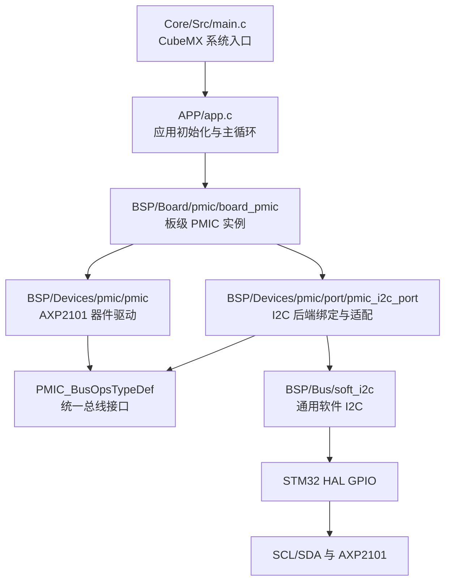

# PMIC 与 I2C 子系统技术文档

> 适用工程：`version0.1.1`
>
> 当前芯片：AXP2101
>
> 当前总线后端：GPIO 模拟软件 I2C
>
> 文档状态：已按 `version0.1.1` 当前代码复核

## 1. 文档目的

本文档记录 PMIC 与 I2C 子系统当前的分层、调用链、句柄、操作表、错误传递方式和扩展规则。以后修改代码前，应先用本文确认：

- 某段代码应放在哪一层；
- 哪些接口允许上层调用；
- 哪些变量由哪个模块拥有；
- 软件 I2C 如何替换为硬件 I2C；
- 初始化失败后应查看哪些错误字段；
- 新增 QSPI Flash、SD Card、SPI LCD 等设备时如何复用当前设计。

本文描述的是当前代码事实。若代码接口、目录或启动配置发生变化，应同步更新本文。

## 2. 术语

| 术语 | 本工程中的含义 |
| --- | --- |
| Board | 板级装配层，创建本 PCB 使用的具体设备实例，决定设备地址和启动策略。 |
| Device | 器件驱动层，实现 AXP2101 的寄存器语义、芯片识别和配置流程。 |
| Port | 适配层，把当前选用的 I2C 实现转换为 PMIC 驱动需要的统一接口。 |
| Bus | 通用总线实现层；当前为可复用的软件 I2C 驱动。 |
| Handle | 句柄，保存一个设备或总线实例的配置、状态和错误信息。 |
| Ops | 函数指针操作表，描述某种底层实现能提供哪些操作。 |
| Context | 传给 Ops 函数的底层实例指针，相当于 C++ 成员函数中的 `this`。 |
| Backend | Port 当前选择的具体底层实现，例如软件 I2C 或 HAL 硬件 I2C。 |
| 7 位地址 | 不包含最低读写位的 I2C 从机地址；AXP2101 当前使用 `0x34`。 |

## 3. 总体分层



关键依赖方向：

1. `main.c` 只调用 `app_init()/app_run()`，不直接依赖 PMIC 或日志实现。
2. Board 层创建 `hpmic`，但不保存软件 I2C 句柄。
3. Device 层只调用 `PMIC_BusOpsTypeDef`，不包含 GPIO、SoftI2C 或 HAL I2C 类型。
4. Port 层同时了解 PMIC 总线抽象和当前 I2C 后端，负责二者转换。
5. Bus 层实现通用 I2C 时序，不了解 AXP2101。

这种依赖方向避免了器件驱动和某个 MCU 外设实现绑定。

## 4. 目录和文件职责

| 文件 | 层 | 职责 | 不应包含的内容 |
| --- | --- | --- | --- |
| `Core/Src/main.c` | 系统入口 | 初始化 HAL、时钟、GPIO、USB，调用 `app_init()/app_run()`。 | AXP2101 寄存器配置、应用策略。 |
| `APP/app.c/.h` | Application | 初始化日志和板级设备，初始化可选 SD 卡，周期推进日志、SD 热插拔与 LED 心跳。 | 软件 I2C 位操作、AXP2101 裸寄存器值。 |
| `BSP/Board/pmic/board_pmic.c/.h` | Board | 定义私有 `hpmic`，绑定后端并组织 PMIC 初始化和板级电源轨控制。 | `SoftI2C_HandleTypeDef`、SCL/SDA 时序、寄存器读写细节。 |
| `BSP/Devices/pmic/pmic.c/.h` | Device | 定义 PMIC 抽象类型，识别 AXP2101，保存诊断信息，应用启动配置。 | 具体 GPIO、HAL I2C 句柄、软件 I2C 函数调用。 |
| `BSP/Devices/pmic/axp2101_regs.h` | Device 数据 | 保存 AXP2101 地址、芯片 ID、寄存器地址等器件定义。 | 板级引脚和应用业务逻辑。 |
| `BSP/Devices/pmic/port/pmic_i2c_port.c/.h` | Port | 创建当前后端上下文，映射状态，向 `hpmic` 注入 Ops 和 Context。 | AXP2101 启动配置表、应用策略。 |
| `BSP/Bus/soft_i2c/soft_i2c.c/.h` | Bus | 实现阻塞式软件 I2C、普通收发、寄存器收发、时钟拉伸和恢复。 | AXP2101 地址、寄存器和值。 |

后续目录建议继续遵守同一规则：

- QSPI、SPI、SDMMC 等通用总线放 `BSP/Bus/`；
- Flash、SD Card、LCD 控制器等器件驱动放 `BSP/Devices/`；
- 本 PCB 的具体实例、片选、复位和总线选择放 `BSP/Board/`；
- 音乐播放、电源策略、界面状态等产品行为放 `APP/`。

## 5. 上电后的完整调用链

### 5.1 系统入口

`main()` 与应用层当前执行顺序：

1. `HAL_Init()`：初始化 HAL、Flash 接口和 SysTick；
2. `SystemClock_Config()`：配置系统时钟；
3. `MX_GPIO_Init()`：配置 GPIO，软件 I2C 的 SCL/SDA 必须为开漏并具备外部上拉；
4. `MX_USB_DEVICE_Init()`：初始化 USB Device/CDC；
5. `MX_I2S2_Init()`：准备当前 Audio Port 使用的 I2S2 句柄；
6. `app_init()` 先调用 `LOG_Init()`，再调用 `Board_Init()`；
7. `Board_Init()` 依次初始化 IRQ Dispatcher、板级 PMIC、ALDO1 音频供电和 Audio Device；
8. `Board_Init()` 失败时 APP 记录日志并进入 `Error_Handler()`；
9. 强依赖设备成功后，APP 单独调用 `Board_SD_Init()` 初始化可选 SD 卡；
10. 主循环持续调用 `app_run()`，推进 USB 日志、SD 热插拔处理和 LED 心跳。

因此，GPIO 初始化必须位于 PMIC 初始化之前；USB Device 初始化必须位于日志
开始消费队列之前。启动期 `LOG_Printf()` 只把消息复制进 RAM 队列，实际 USB
提交发生在主循环 `LOG_Process()` 中，完整机制见 `log_architecture.md`。

### 5.2 Board 层装配

`Board_PMIC_Init()` 执行：

1. 调用 `PMIC_I2C_Port_Bind(&hpmic)`。
2. Port 将 `hpmic.BusOps` 指向私有 `pmic_i2c_port_ops`。
3. Port 将 `hpmic.BusContext` 指向私有 `hpmic_i2c`。
4. 绑定成功后调用 `PMIC_Init(&hpmic)`。

`PMIC_I2C_Port_Bind()` 只赋指针，不会访问 GPIO、不会产生 I2C 波形，也不会初始化芯片。

### 5.3 PMIC 设备初始化

`PMIC_Init()` 执行：

1. 验证 `hpmic` 非空。
2. 装载 `PMIC_DEFAULT_ADDRESS_7BIT` 和 `PMIC_DEFAULT_BOOT_CONFIG`，重置状态并清除旧错误。
3. 验证 `BusOps`、三个 Ops 函数、`BusContext`、7 位地址和启动策略。
4. 将 `State` 设置为 `PMIC_STATE_BUSY`。
5. 调用 `BusOps->Prepare(BusContext)` 准备底层总线。
6. 调用私有 `pmic_read_reg()` 读取 `XPOWERS_AXP2101_IC_TYPE`（`0x03`）。
7. 校验读到的芯片 ID 是否为 `XPOWERS_AXP2101_CHIP_ID`（`0x47`）。
8. 若 `ApplyBootConfig == PMIC_BOOT_CONFIG_ENABLED`，调用 `pmic_apply_boot_config()`。
9. 全部成功后将 `State` 设置为 `PMIC_STATE_READY` 并返回 `PMIC_OK`。

任一步失败都会通过 `pmic_fail()` 保存诊断信息，并把 `State` 设置为 `PMIC_STATE_ERROR`。

### 5.4 总线准备与自动恢复

当前 `BusOps->Prepare()` 指向 `pmic_i2c_port_prepare()`，它继续调用 `SoftI2C_Init()`：

1. 验证软件 I2C 句柄、端口、引脚和时序参数。
2. 将软件 I2C 状态设为 `SOFT_I2C_STATE_BUSY` 并清除 `ErrorCode`。
3. 释放 SDA。
4. 释放 SCL，并等待 SCL 实际变高；等待超限则返回 `SOFT_I2C_TIMEOUT`。
5. 若 SDA 为低，自动调用私有 `SoftI2C_RecoverInternal()`。
6. 恢复函数最多输出 9 个 SCL 脉冲，然后产生 STOP。
7. 若 SDA 仍低，记录 `SOFT_I2C_ERROR_BUS_BUSY` 并返回 `SOFT_I2C_BUSY`。
8. 成功后将软件 I2C 状态设为 `SOFT_I2C_STATE_READY`。

自动 Recover 只在 `SoftI2C_Init()` 发现 SDA 被拉低时执行。目前普通读写失败后不会自动重试或自动 Recover；上层需要重新执行初始化，或者未来单独设计恢复策略。

### 5.5 芯片 ID 寄存器读取链

芯片 ID 读取的实际链路是：

```text
PMIC_Init
  -> pmic_read_reg
    -> hpmic.BusOps->MemRead
      -> pmic_i2c_port_mem_read
        -> SoftI2C_MemRead
          -> START
          -> 7位地址 + Write
          -> 8位寄存器地址
          -> Repeated START
          -> 7位地址 + Read
          -> 读取数据，最后一个字节后发送 NACK
          -> STOP
        -> pmic_i2c_port_status
      -> PMIC_BusStatusTypeDef
    -> 失败时 pmic_fail
```

AXP2101 的地址始终以 7 位形式传递。软件 I2C 在真正发送时才执行：

```c
device_address_7bit << 1        /* 写地址字节 */
(device_address_7bit << 1) | 1  /* 读地址字节 */
```

调用者不得提前把 `0x34` 左移成 `0x68`。

### 5.6 启动配置链

启动配置由 `hpmic.ApplyBootConfig` 控制：

- `PMIC_BOOT_CONFIG_DISABLED`：只初始化总线并校验芯片 ID，不改写配置。
- `PMIC_BOOT_CONFIG_ENABLED`：校验芯片 ID 后应用 `pmic_boot_profile[]`。

`pmic_apply_boot_config()` 首先通过 `pmic_update_bits()` 对 `REG10H` 做读－改－写，然后按顺序写入启动配置表。任一读写失败立即停止，不继续写后续寄存器。

## 6. C 语言中的“面向对象”设计

当前设计使用的是 C 语言中的组合、依赖注入和函数指针多态，不是完整的 C++ 类系统。

### 6.1 对象：Handle

`PMIC_HandleTypeDef hpmic` 可以看成一个 PMIC 对象实例：

- 配置：`Address7Bit`、`ApplyBootConfig`；
- 依赖：`BusOps`、`BusContext`；
- 运行状态：`State`；
- 错误上下文：`ErrorCode`、`LastBusStatus`、`LastFailedRegister`。

`SoftI2C_HandleTypeDef hpmic_i2c` 可以看成一个软件 I2C 对象实例，但它是 Port 私有变量，上层不能直接访问。

### 6.2 接口与虚函数表：PMIC_BusOpsTypeDef

`PMIC_BusOpsTypeDef` 就是一个简单的 Ops 表，也可以理解为虚函数表：

```c
typedef struct
{
    PMIC_BusPrepareFunc Prepare;
    PMIC_BusMemReadFunc MemRead;
    PMIC_BusMemWriteFunc MemWrite;
} PMIC_BusOpsTypeDef;
```

PMIC 驱动只知道这些函数的签名，不知道函数内部是软件 I2C、HAL I2C 还是测试桩。

### 6.3 this 指针：BusContext

Ops 函数没有 C++ 隐式 `this`，所以显式接收 `void *context`：

```c
hpmic->BusOps->MemRead(hpmic->BusContext, ...);
```

当前软件 I2C 后端把 `BusContext` 解释为 `SoftI2C_HandleTypeDef *`。未来 HAL I2C 后端可把它解释为自定义 HAL Port 上下文或 `I2C_HandleTypeDef *`。

Ops 和 Context 必须成对安装。若 Ops 来自软件 I2C、Context 却指向 HAL I2C 句柄，强制转换后会产生未定义行为。

### 6.4 多态

多态发生在 `BusOps`：同一份 `PMIC_Init()` 可以调用不同实现的 `Prepare/MemRead/MemWrite`。

当前实际对象关系：

```text
hpmic
  BusOps     -> pmic_i2c_port_ops
  BusContext -> hpmic_i2c (SoftI2C_HandleTypeDef)
```

切换到 HAL I2C 后可以变成：

```text
hpmic
  BusOps     -> pmic_i2c_port_ops
  BusContext -> hpmic_i2c (HAL后端上下文)
```

对 Device 层而言，调用方式完全不变。

### 6.5 继承

当前代码没有结构体首成员嵌套式继承，也不需要继承。PMIC 和 I2C 是“设备依赖总线”的组合关系，不是“PMIC 是一种 I2C”的继承关系。

若未来支持多种 PMIC 芯片，更适合新增“PMIC 芯片操作表”或独立器件驱动，而不是让 AXP2101 结构体继承软件 I2C 结构体。

## 7. 结构体详细说明

### 7.1 PMIC_HandleTypeDef

| 字段 | 由谁设置 | 作用 | 是否可由上层修改 |
| --- | --- | --- | --- |
| `BusOps` | `PMIC_I2C_Port_Bind()` | 指向当前总线实现的 Ops 表。 | 不建议；由 Port 管理。 |
| `BusContext` | `PMIC_I2C_Port_Bind()` | 指向当前总线实例。 | 不建议；必须与 Ops 配对。 |
| `Address7Bit` | `PMIC_Init()` | PMIC 的 7 位默认地址，当前来自 `AXP2101_SLAVE_ADDRESS`。 | 只读观察；默认策略由 Device 装载。 |
| `ApplyBootConfig` | `PMIC_Init()` | 控制是否写入内置启动配置。 | 只读观察；默认策略由 Device 装载。 |
| `State` | PMIC 驱动 | RESET、BUSY、READY 或 ERROR。 | 只读观察，不应由应用伪造。 |
| `ErrorCode` | PMIC 驱动 | PMIC 层对失败阶段的分类。 | 只读观察。 |
| `LastBusStatus` | PMIC 驱动 | OK、ERROR、BUSY、TIMEOUT 或 NACK。 | 只读观察。 |
| `LastFailedRegister` | PMIC 驱动 | 最近一次失败涉及的寄存器地址。 | 只读观察。 |

### 7.2 PMIC_BusStatusTypeDef

Port 的每个操作直接返回 `PMIC_BusStatusTypeDef`：`OK`、`ERROR`、`BUSY`、
`TIMEOUT` 或 `NACK`。Device 因而不需要知道 SoftI2C/HAL 的状态类型，也不
复制后端原始错误位。若需要深入诊断，可在调试器中查看当前 Port 私有
句柄的 `ErrorCode`。

### 7.3 SoftI2C_HandleTypeDef

| 字段 | 作用 |
| --- | --- |
| `SCL_Port/SCL_Pin` | SCL 的 HAL GPIO 端口和引脚掩码。 |
| `SDA_Port/SDA_Pin` | SDA 的 HAL GPIO 端口和引脚掩码。 |
| `DelayCycles` | 每个时序阶段的忙等待循环次数，不是微秒。 |
| `ClockStretchTimeout` | 等待 SCL 被释放为高电平的最大轮询次数。 |
| `State` | 软件 I2C 当前状态。 |
| `ErrorCode` | 最近一次操作的底层错误位集合。 |

`DelayCycles` 的实际时间受 CPU 主频、编译优化和循环实现影响。更改时钟树或编译优化等级后，应重新用逻辑分析仪确认 I2C 频率。

## 8. 宏和配置的作用

### 8.1 公共 PMIC 配置宏

| 宏 | 当前值/来源 | 作用 |
| --- | --- | --- |
| `PMIC_DEFAULT_ADDRESS_7BIT` | `AXP2101_SLAVE_ADDRESS` | PMIC 默认 7 位地址。 |
| `AXP2101_SLAVE_ADDRESS` | `0x34` | AXP2101 器件地址定义。 |
| `PMIC_BOOT_CONFIG_DISABLED` | `0` | 初始化时不应用启动配置。 |
| `PMIC_BOOT_CONFIG_ENABLED` | `1` | 初始化时应用启动配置。 |

默认地址引用器件寄存器头文件中的宏是有意设计：当前 PMIC 驱动本身就是 AXP2101 驱动，地址应与同一器件定义保持一致。

### 8.2 REG10H 启动位

这些宏是 `pmic.c` 私有实现，不对外暴露：

| 宏 | 位 | 作用 |
| --- | --- | --- |
| `AXP2101_COMMON_OFF_DISCHARGE_MASK` | bit5 | 输出关闭后启用内部放电。 |
| `AXP2101_COMMON_PWROK_RESTART_MASK` | bit3 | PWROK 被外部拉低时重启。 |
| `AXP2101_COMMON_PWRON_16S_SHUTDOWN_MASK` | bit2 | PWRON 持续 16 秒时关机。 |
| `AXP2101_COMMON_RESTART_ACTION_MASK` | bit1 | 写 1 会立即重启，启动配置中必须清零。 |
| `AXP2101_COMMON_POWEROFF_ACTION_MASK` | bit0 | 写 1 会立即关机，启动配置中必须清零。 |

`AXP2101_COMMON_BOOT_MASK` 表示允许启动流程修改哪些位；`AXP2101_COMMON_BOOT_VALUE` 表示这些位的目标值。实际计算为：

```c
new_value = (old_value & ~mask) | (boot_value & mask);
```

因此未进入 Mask 的位保持原值，而 bit1/bit0 虽然进入 Mask，却没有进入 Value，会被明确清零，避免误重启或误关机。

### 8.3 Port 时序宏

| 宏 | 当前值 | 作用 |
| --- | --- | --- |
| `PMIC_I2C_PORT_DELAY_CYCLES` | `800` | 软件 I2C 每个时序阶段的忙等待次数。 |
| `PMIC_I2C_PORT_CLOCK_STRETCH_TIMEOUT` | `1000` | 等待 SCL 变高的最大轮询次数。 |

这两个宏属于当前软件 I2C 后端，切换硬件 I2C 时可从 Port 中删除。

## 9. 当前启动配置表

`pmic_boot_profile[]` 是 `pmic.c` 私有静态常量。当前顺序如下：

| 寄存器 | 地址 | 写入值 | 当前注释含义 |
| --- | ---: | ---: | --- |
| `MIN_SYS_VOL_CTRL` | `0x14` | `0x50` | VSYSDPM 4.6 V。 |
| `INPUT_VOL_LIMIT_CTRL` | `0x15` | `0x06` | VBUS 电压限制 4.36 V。 |
| `INPUT_CUR_LIMIT_CTRL` | `0x16` | `0x01` | 输入电流限制 500 mA。 |
| `ADC_CHANNEL_CTRL` | `0x30` | `0x1F` | 启用当前选择的 ADC 通道。 |
| `INTEN1/2/3` | `0x40`～`0x42` | `0x00` | 禁用中断使能。 |
| `INTSTS1/2/3` | `0x48`～`0x4A` | `0xFF` | 清除已有中断状态。 |
| `ICC_CHG_SET` | `0x62` | `0x09` | 充电电流 300 mA。 |
| `ITERM_CHG_SET_CTRL` | `0x63` | `0x15` | 终止电流 125 mA。 |
| `CV_CHG_VOL_SET` | `0x64` | `0x03` | 充电电压 4.2 V。 |
| `DC_ONOFF_DVM_CTRL` | `0x80` | `0x01` | 保持 DCDC1 开启。 |
| `LDO_ONOFF_CTRL0` | `0x90` | `0x04` | 关闭 ALDO1/2，保持 ALDO3。 |
| `LDO_ONOFF_CTRL1` | `0x91` | `0x00` | 关闭该寄存器管理的输出。 |
| `LDO_VOL0_CTRL` | `0x92` | `0x1C` | ALDO1 预设 3.3 V。 |
| `LDO_VOL1_CTRL` | `0x93` | `0x1C` | ALDO2 预设 3.3 V。 |

注意：电压配置值和输出使能是两件事。把 ALDO1 的电压寄存器设为 3.3 V，并不等于 ALDO1 已经开启。

修改这张表属于电源策略变更，应同时核对原理图、AXP2101 手册、负载允许电压和上电顺序。

## 10. 对外开放的接口

### 10.1 Board 层推荐接口

| 接口 | 使用者 | 说明 |
| --- | --- | --- |
| `Board_PMIC_Init()` | `Board_Init()` | 绑定并初始化本板唯一的 AXP2101。 |
| `Board_Audio_SetPower(bool)` | Board/Application 策略 | 通过 ALDO1 开关音频电源。 |
| `Board_LCD_SetPower(bool)` | Board/Application 策略 | 通过 ALDO2 开关 LCD 电源。 |

`hpmic` 是 `board_pmic.c` 的私有 `static` 实例，应用不能直接访问。Board 在失败时读取其诊断字段并写入日志；以后若需要向上层提供诊断，应增加只读快照接口，而不是公开句柄。

### 10.2 PMIC 驱动接口

| 接口 | 使用者 | 说明 |
| --- | --- | --- |
| `PMIC_Init(PMIC_HandleTypeDef *)` | Board 层或独立测试 | 通用 PMIC 初始化入口，调用前必须已经绑定总线。 |
| `PMIC_SetALDO1Enabled(PMIC_HandleTypeDef *, bool)` | Board 层 | 读-改-写 REG90H 的 ALDO1 使能位。 |
| `PMIC_SetALDO2Enabled(PMIC_HandleTypeDef *, bool)` | Board 层 | 读-改-写 REG90H 的 ALDO2 使能位。 |

当前 PMIC Device 层没有公开任意寄存器读写接口，`pmic_read_reg()` 和 `pmic_write_reg()` 都是 `static`。这是为了避免应用层绕过器件语义直接修改危险寄存器。

以后应优先增加语义明确的接口，例如 `PMIC_SetAldoVoltage()`、`PMIC_GetBatteryVoltage()`，而不是直接向 Application 暴露裸寄存器读写。若确实需要调试接口，应明确标记其风险和使用范围。

### 10.3 Port 接口

| 接口 | 使用者 | 说明 |
| --- | --- | --- |
| `PMIC_I2C_Port_Bind(PMIC_HandleTypeDef *)` | Board 层 | 注入当前后端的 Ops 和 Context；不初始化总线。 |

Port 的 `pmic_i2c_port_ops` 和 `hpmic_i2c` 均为 `static`，不对外暴露。

### 10.4 软件 I2C 公共接口

| 接口 | 作用 |
| --- | --- |
| `SoftI2C_Init()` | 初始化并在需要时自动恢复总线。 |
| `SoftI2C_IsDeviceReady()` | 探测指定 7 位地址是否 ACK。 |
| `SoftI2C_MasterTransmit()` | 普通主机发送，不带寄存器地址语义。 |
| `SoftI2C_MasterReceive()` | 普通主机接收，不带寄存器地址语义。 |
| `SoftI2C_MemRead()` | 使用 8 位或 16 位内部地址读取寄存器/存储器。 |
| `SoftI2C_MemWrite()` | 使用 8 位或 16 位内部地址写入寄存器/存储器。 |

这些接口属于通用 Bus 层，可以被其他软件 I2C 设备复用，但每个实例应使用自己的 `SoftI2C_HandleTypeDef`。

## 11. 哪些调用可以重复执行

| 操作 | 能否重复 | 条件和副作用 |
| --- | --- | --- |
| `PMIC_I2C_Port_Bind(&hpmic)` | 可以 | 重复写入相同的 Ops 和 Context 指针，不产生总线波形。 |
| `SoftI2C_Init(&handle)` | 可以 | 会重新检查/恢复总线、清除旧底层错误并重置状态。 |
| `PMIC_Init(&hpmic)` | 技术上可以 | 会清除旧错误、重新识别芯片并重新应用启动表；当前启动表会关闭 ALDO1/2，因此运行期重复调用可能切断 Audio/LCD 电源。 |
| `Board_PMIC_Init()` | 仅建议在启动或受控重初始化流程调用 | 等价于重新绑定并重新执行 `PMIC_Init()`；不得与传输并发，调用后还必须按整机策略重新开启所需电源轨。 |
| 软件 I2C 收发接口 | 可以 | 仅在句柄为 READY 时；均为阻塞调用，不支持同一句柄并发。 |
| 读取 `hpmic` 错误字段 | 可以 | 建议只读；日志读取时应考虑错误可能被下一次初始化覆盖。 |

`volatile` 只表示每次都从内存读取或写入，不提供线程安全、互斥或原子事务。未来加入 RTOS 后，应在总线层或更上层增加互斥保护。

## 12. 错误传递和诊断边界

### 12.1 三层错误信息

错误沿以下路径传递：

```text
SoftI2C_StatusTypeDef + SoftI2C_HandleTypeDef.ErrorCode
  -> pmic_i2c_port_status()
  -> PMIC_BusStatusTypeDef
  -> pmic_fail()
  -> hpmic.ErrorCode + LastBusStatus + LastFailedRegister
  -> Board_PMIC_Init() 返回 BOARD_PMIC_ERROR
  -> app_init() 记录归一化日志并进入 Error_Handler()
```

三种公开诊断信息的分工：

- `hpmic.ErrorCode`：失败发生在 PMIC 操作的哪个语义阶段；
- `hpmic.LastBusStatus`：底层属于 ERROR、BUSY、TIMEOUT 还是 NACK；
- `hpmic.LastFailedRegister`：失败访问的是哪个寄存器。

`SoftI2C_HandleTypeDef.ErrorCode` 不再复制到 PMIC Handle。它是当前后端的
私有诊断细节，只有在归一化状态还不足以定位问题时，才通过调试器查看
Port 内的 `hpmic_i2c.ErrorCode`。这样切换为 HAL I2C 后，Device、Board 和
日志格式不必理解另一套原始错误位。

### 12.2 软件 I2C 原始错误位

| 宏 | 值 | 含义 | Port 统一状态 |
| --- | ---: | --- | --- |
| `SOFT_I2C_ERROR_NONE` | `0x00` | 无错误。 | `PMIC_BUS_OK` |
| `SOFT_I2C_ERROR_BUS_BUSY` | `0x01` | SDA 被占用或总线无法恢复。 | 通常 `PMIC_BUS_BUSY` |
| `SOFT_I2C_ERROR_NACK_ADDRESS` | `0x02` | 从机地址未应答。 | `PMIC_BUS_NACK` |
| `SOFT_I2C_ERROR_NACK_DATA` | `0x04` | 数据字节未应答。 | `PMIC_BUS_NACK` |
| `SOFT_I2C_ERROR_SCL_TIMEOUT` | `0x08` | SCL 长时间无法变高。 | `PMIC_BUS_TIMEOUT` |
| `SOFT_I2C_ERROR_INVALID_PARAM` | `0x10` | 句柄、地址、缓冲区或长度非法。 | `PMIC_BUS_ERROR` |

`ErrorCode` 是位掩码，理论上可以同时存在多个位。判断时应使用按位与，而不是只使用相等比较。

### 12.3 调试器查看顺序

初始化失败时建议依次查看：

1. `hpmic.State`
2. `hpmic.ErrorCode`
3. `hpmic.LastBusStatus`
4. `hpmic.LastFailedRegister`
5. 若仍不能定位，再查看 Port 私有的 `hpmic_i2c.ErrorCode`

常见组合：

| ErrorCode | LastBusStatus | LastFailedRegister | 优先检查 |
| --- | --- | ---: | --- |
| `PMIC_ERROR_BUS_PREPARE` | `PMIC_BUS_BUSY` | `0x00` | SDA 是否一直为低、焊接、上拉、引脚映射。 |
| `PMIC_ERROR_BUS_PREPARE` | `PMIC_BUS_TIMEOUT` | `0x00` | SCL 是否被拉低、引脚模式、短路或时钟拉伸。 |
| `PMIC_ERROR_BUS_READ` | `PMIC_BUS_NACK` | `0x03` | AXP2101 地址、SDA/SCL 是否对调、芯片焊接和供电。 |
| `PMIC_ERROR_WRONG_CHIP_ID` | `PMIC_BUS_OK` | `0x03` | 波形能通信但器件返回值不是 `0x47`。 |
| `PMIC_ERROR_BUS_WRITE` | `PMIC_BUS_NACK` | 某配置地址 | 从机在数据阶段 NACK、供电状态或写入条件。 |

## 13. 软件 I2C 的执行特性

- 所有 API 都是同步阻塞式。
- 时序延迟使用循环忙等待，不调用 `HAL_Delay()`。
- 等待 SCL 释放同样使用轮询计数，不使用毫秒超时。
- SCL、SDA 必须是开漏输出，并且总线上必须有合适的上拉。
- 驱动支持时钟拉伸检测。
- 同一个句柄同一时间只能执行一个操作。
- 不建议在中断服务函数中调用。

软件 I2C 适合当前早期点板和引脚灵活性需求。后续吞吐量、CPU 占用或 RTOS 实时性要求提高时，应切换硬件 I2C。

## 14. 切换为 HAL 硬件 I2C

只修改 `pmic_i2c_port.c` 中三个标记区域：

1. `PMIC I2C PORT BACKEND BEGIN/END: Includes`
2. `PMIC I2C PORT BACKEND BEGIN/END: Configuration`
3. `PMIC I2C PORT BACKEND BEGIN/END: Implementation`

建议保持以下内部符号名称不变：

```c
hpmic_i2c
pmic_i2c_port_prepare
pmic_i2c_port_mem_read
pmic_i2c_port_mem_write
```

这样标记区域外的 `pmic_i2c_port_ops` 和 `PMIC_I2C_Port_Bind()` 无需修改。

硬件 I2C 后端必须完成：

- 把 7 位地址转换为 HAL API 所要求的地址格式；STM32 HAL Mem API 通常接收左移一位后的地址，应以具体 HAL 声明为准；
- 使用 `I2C_MEMADD_SIZE_8BIT` 访问 AXP2101 寄存器；
- 把 `HAL_OK/HAL_BUSY/HAL_TIMEOUT/HAL_ERROR` 转为 `PMIC_BusStatusTypeDef`；
- HAL 原始错误只保留在硬件 I2C 句柄中；若可识别 AF/NACK，可在 Port
  内将其归一化为 `PMIC_BUS_NACK`；
- 确保 `Prepare()` 在 CubeMX 初始化顺序下有效。若硬件 I2C 已由 `MX_I2Cx_Init()` 初始化，Prepare 可做状态检查或返回 OK。

Board、PMIC Device 和 Application 不应因切换后端而修改。

## 15. CMake 收集规则

顶层 `CMakeLists.txt` 当前递归收集：

```cmake
BSP/Bus/*.c
BSP/Devices/*.c
BSP/Board/*.c
```

同时递归收集 `System/Log/*.c` 和 `USB_DEVICE/App|Target/*.c`，并把工程根目录
`${CMAKE_CURRENT_SOURCE_DIR}` 添加为包含目录。因此工程自维护代码使用从根目录
开始的完整包含路径：

```c
#include "BSP/Devices/pmic/pmic.h"
#include "BSP/Bus/soft_i2c/soft_i2c.h"
#include "BSP/Board/pmic/board_pmic.h"
```

比 `#include "./pmic/pmic.h"` 更清楚，因为包含路径同时表达工程根、所属层和模块。

新增这些目录下的 `.c` 文件后，CMake 的 `CONFIGURE_DEPENDS` 会触发重新配置。不要把临时测试 `.c` 放进 `BSP`，否则也会被编入固件。

注意：CubeMX 生成的 `cmake/stm32cubemx/CMakeLists.txt` 当前也列出了同一批
`USB_DEVICE` 源文件；顶层 `USB_DEVICE_SOURCES` 因而属于重复收集。当前 CMake
构建能够正常去重/处理这些路径，但后续整理构建规则时可删除顶层 USB glob，
让生成的 `stm32cubemx` INTERFACE target 单独管理官方源文件。此次仅同步注释
和文档，没有改变现有构建输入。

## 16. 扩展规则

### 16.1 新增 PMIC 功能

例如读取电池电压或设置 LDO：

1. 在 `axp2101_regs.h` 增加经过手册核对的寄存器/位定义。
2. 在 `pmic.c` 实现私有寄存器操作和数值换算。
3. 在 `pmic.h` 只暴露具有明确器件语义的公共函数。
4. 使用 `PMIC_StatusTypeDef` 返回结果，并通过句柄保存详细错误。
5. 不在 Application 中直接调用 `SoftI2C_MemRead/MemWrite` 操作 PMIC。

### 16.2 新增其他 I2C 器件

- 复用 `BSP/Bus/soft_i2c`；
- 为新器件建立独立的 `BSP/Devices/<device>`；
- 在 `BSP/Board` 创建该器件的板级实例；
- 不把新器件寄存器塞进 `pmic.c`。

### 16.3 新增 QSPI Flash、SD Card、SPI LCD

- 总线控制器和通用传输封装：`BSP/Bus`；
- 具体芯片命令、寄存器和协议：`BSP/Devices`；
- PCB 引脚、片选、复位、背光和实例绑定：`BSP/Board`；
- 文件系统、图片加载等可复用服务放 `System/`，界面和电源管理策略等产品行为放 `APP/`。

是否需要 Ops 抽象，应根据是否存在多种后端、是否需要主机测试以及器件驱动是否会复用决定，不必为每个简单模块机械增加函数指针。

## 17. 当前限制和后续改进点

1. PMIC Device 当前公开初始化和 ALDO1/ALDO2 使能控制，尚未提供电池状态、ADC、电压配置等更完整的语义接口。
2. `pmic_boot_profile[]` 仍是固定的寄存器和值，后续可演进为带字段含义的配置结构体。
3. Port 只保存一个静态 `hpmic_i2c`，适合当前单 PMIC；多实例需要独立上下文或让 Board 注入上下文。
4. 软件 I2C 没有 RTOS 互斥，也没有异步传输。
5. Recover 只在初始化时自动执行，没有读写失败重试策略。
6. Device/Board 日志只记录稳定的 `ErrorCode`、`LastBusStatus` 和失败寄存器；
   后端原始错误仅用于 Port 内断点诊断。
7. 当前后端通过修改 Port 源码选择，没有增加软件/硬件 I2C 编译宏。这保持了单一明确实现，但不支持一份构建配置动态切换。
8. 启动配置会改变供电轨和充电参数，改动必须经过硬件核对与实测。

## 18. 文档维护清单

发生以下变化时必须更新本文：

- `PMIC_HandleTypeDef`、`SoftI2C_HandleTypeDef` 增删字段；
- Ops 表增加普通收发、锁、恢复或其他函数；
- PMIC 增加公共功能接口；
- 启动配置表、寄存器值或电源轨策略变化；
- 软件 I2C 切换为硬件 I2C；
- 目录层级或 CMake 收集规则变化；
- 错误码和状态映射变化；
- 加入 RTOS、互斥或异步 I2C 传输；日志系统变化记录在 `log_architecture.md`。

维护时优先更新“调用链”“结构体字段”“错误传递”“对外接口”和“当前限制”五部分，避免代码已变但文档仍描述旧行为。

## 19. 代码索引

- 系统入口：[`../Core/Src/main.c`](../Core/Src/main.c)
- 应用入口：[`../APP/app.c`](../APP/app.c)
- Board 实例：[`../BSP/Board/pmic/board_pmic.c`](../BSP/Board/pmic/board_pmic.c)
- Board 公共接口：[`../BSP/Board/pmic/board_pmic.h`](../BSP/Board/pmic/board_pmic.h)
- PMIC 驱动实现：[`../BSP/Devices/pmic/pmic.c`](../BSP/Devices/pmic/pmic.c)
- PMIC 公共类型和接口：[`../BSP/Devices/pmic/pmic.h`](../BSP/Devices/pmic/pmic.h)
- AXP2101 寄存器定义：[`../BSP/Devices/pmic/axp2101_regs.h`](../BSP/Devices/pmic/axp2101_regs.h)
- PMIC I2C Port：[`../BSP/Devices/pmic/port/pmic_i2c_port.c`](../BSP/Devices/pmic/port/pmic_i2c_port.c)
- 软件 I2C：[`../BSP/Bus/soft_i2c/soft_i2c.c`](../BSP/Bus/soft_i2c/soft_i2c.c)
- 构建规则：[`../CMakeLists.txt`](../CMakeLists.txt)
- 日志架构：[`log_architecture.md`](log_architecture.md)
